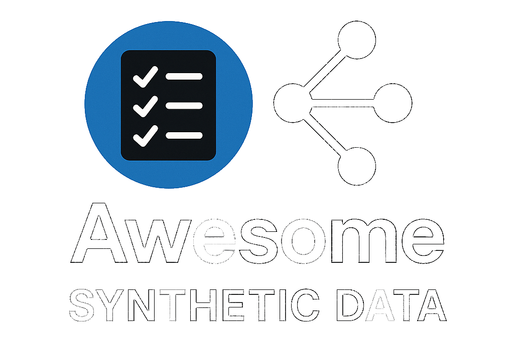

<!-- title -->

<!--lint ignore no-dead-urls-->

# Awesome Synthetic Data  

<!-- subtitle -->

A list of tools, papers and datasets on synthetic data generations and use!

<!-- image -->

<!-- TOC -->

## Contents

- [Featured (new releases)](#featured)
- [Tools](#tools)

## Featured (new releases)

- [DeepFabric](https://github.com/lukehinds/deepfabric/) - Create large-scale synthetic training data for model distillation and fine-tuning of LLMs.

## Tools

- [CTGAN](https://github.com/sdv-dev/CTGAN) - Conditional GAN for generating synthetic tabular data.

- [DoppelGANger](https://github.com/fjxmlzn/DoppelGANger) - Using GANs for Sharing Networked Time Series Data: Challenges, Initial Promise, and Open Questions

- [synner](https://github.com/huda-lab/synner) - Generating Realistic Synthetic Data

- [SDV](https://github.com/sdv-dev/SDV) - Synthetic data generation for tabular data

- [TGAN](https://github.com/sdv-dev/SDV) - Generative adversarial training for generating synthetic tabular data.

- [MirrorDataGenerator](https://github.com/DataResponsibly/MirrorDataGenerator) - MirrorDataGenerator is a python tool that generates synthetic data based on user-specified causal relations

- [plaitpy](https://github.com/plaitpy/plaitpy) - plait.py - a fake data modeler

## Contributing

[Contributions of any kind welcome, just follow the guidelines](contributing.md)!

### Contributors

[Thanks goes to these contributors](https://github.com/vdesai-dev/awesome-synthetic-data/graphs/contributors)!
